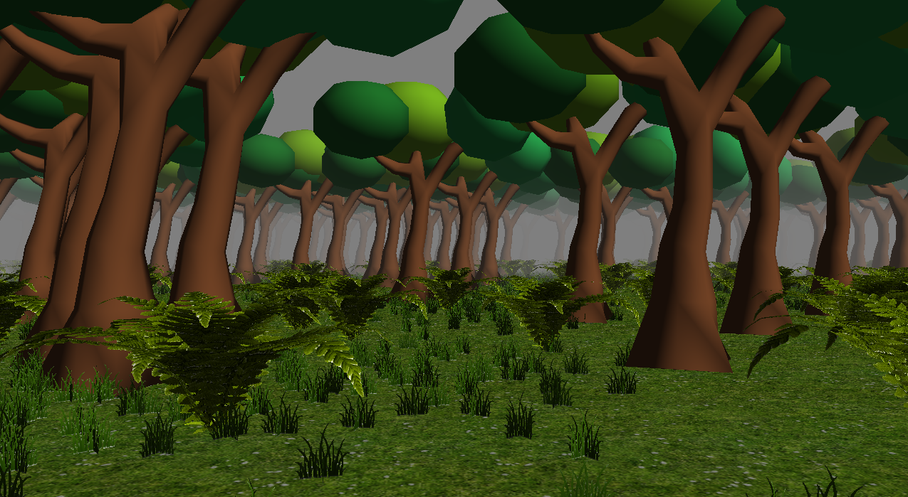

# Belerophon
**Belerophon** é Jogo 3D Desenvolvido com Java e LWJGL 2 usando Slick-Utils,(usando o tutorial do Thin Matrix do mecanismo LA 3D WJGL).

Jogo em fase de criação.

Se você é fã de games e tem interesse em saber como programar e como funciona os mecanismo de um jogo, eu indico o canal do You tube do ThinMatrix programador Indie developer de jogos em 3D :https://www.youtube.com/playlist?list=PLRIWtICgwaX0u7Rf9zkZhLoLuZVfUksDP
